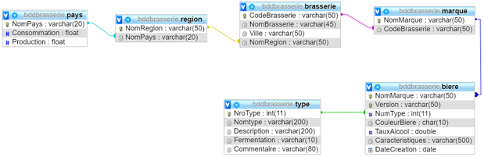

# TD 1 SQL : Base de données Brasserie

## Objectif
Ecrire des requêtes de selection spécifiques sur la base de données définit par le schema suivant

## Démarrage
- Cloner le projet
- Démarrage des conteneurs docker `docker compose up -d`

## Requêtes à effectuer

1.	Liste des bières (Nom marque + version + taux alcool) de l’année 2006 avec un taux d’alcool supérieur ou égal à 10.
2.	Liste des bières (Nom marque) de couleur brune dont le nom commence par la lettre « B ».
3.	Liste des brasseries (code + nom + ville) qui proviennent de Rome ou de Barcelone.
4.	Liste des pays (nom + production) dont la production est comprise entre 30 et 80.
5.	Quelles sont les régions (nom) qui ont la lettre « a » en 3ème position et la lettre « i » en avant dernière position.
6.	Liste des bières (nom marque + taux alcool + couleur) triée par ordre alphabétique (A  Z) sur le nom de la marque puis triée de façon décroissante sur le taux d’alcool et sur la couleur
7.	Liste des bières (nom marque + date création) du mois de mars et qui n’ont pas de caractéristiques.
8.	Liste des couleurs des bières dont le taux d’alcool est supérieur ou égal à 11 ou inférieur ou égal à 3
9.	Quels sont les pays dont la différence entre la production et la consommation est négative. On renommera la colonne « Résultat »
10.	Quelles sont les bières (nom marque + version + couleur) sans alcool.
